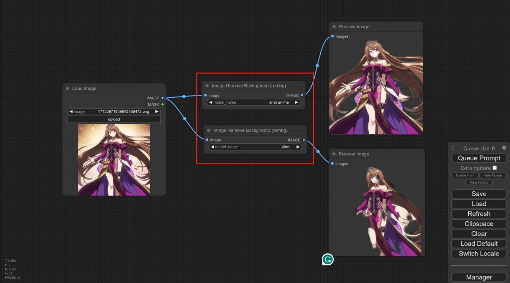

# [Rembg](https://github.com/danielgatis/rembg) Background Removal Node for [ComfyUI](https://github.com/comfyanonymous/ComfyUI)- you can choose which onnx model to use!

Many thanks to the author of **[rembg-comfyui-node](https://github.com/Jcd1230/rembg-comfyui-node)** for his very nice work, this is a very useful tool! 

**But I found something that could refresh this project to better results with better maneuverability!**

In this project, you can **choose the onnx model** you want to use, different models have different effects! **Choosing the right model for you will give you better results!**

Example of use




## How to use

1. Clone to your `custom_nodes` folder in ComfyUI:

```
git clone https://github.com/Loewen-Hob/rembg-comfyui-node-better.git
```

2. Install `rembg[gpu]` (recommended) or `rembg`, depending on GPU support, to your ComfyUI virtual environment. E.g.:

```
pip install rembg[gpu]
```

3. You should have installed the three packages `torch` `Pillow` `numpy`.

4. To use it, just look for the `Image Remove Background (rembg)` node and select the `model` you want to use!


## Optional Models

All models are downloaded and saved in the user home folder in the `.u2net` directory.

The available models are:

- u2net ([download](https://github.com/danielgatis/rembg/releases/download/v0.0.0/u2net.onnx), [source](https://github.com/xuebinqin/U-2-Net)): A pre-trained model for general use cases.
- u2netp ([download](https://github.com/danielgatis/rembg/releases/download/v0.0.0/u2netp.onnx), [source](https://github.com/xuebinqin/U-2-Net)): A lightweight version of u2net model.
- u2net_human_seg ([download](https://github.com/danielgatis/rembg/releases/download/v0.0.0/u2net_human_seg.onnx), [source](https://github.com/xuebinqin/U-2-Net)): A pre-trained model for human segmentation.
- u2net_cloth_seg ([download](https://github.com/danielgatis/rembg/releases/download/v0.0.0/u2net_cloth_seg.onnx), [source](https://github.com/levindabhi/cloth-segmentation)): A pre-trained model for Cloths Parsing from human portrait. Here clothes are parsed into 3 category: Upper body, Lower body and Full body.
- silueta ([download](https://github.com/danielgatis/rembg/releases/download/v0.0.0/silueta.onnx), [source](https://github.com/xuebinqin/U-2-Net/issues/295)): Same as u2net but the size is reduced to 43Mb.
- isnet-general-use ([download](https://github.com/danielgatis/rembg/releases/download/v0.0.0/isnet-general-use.onnx), [source](https://github.com/xuebinqin/DIS)): A new pre-trained model for general use cases.
- isnet-anime ([download](https://github.com/danielgatis/rembg/releases/download/v0.0.0/isnet-anime.onnx), [source](https://github.com/SkyTNT/anime-segmentation)): A high-accuracy segmentation for anime character.
- sam ([download encoder](https://github.com/danielgatis/rembg/releases/download/v0.0.0/vit_b-encoder-quant.onnx), [download decoder](https://github.com/danielgatis/rembg/releases/download/v0.0.0/vit_b-decoder-quant.onnx), [source](https://github.com/facebookresearch/segment-anything)): A pre-trained model for any use cases.


## Organization of work

1. The `sam` model is not easy to use, and I'd like to refine this feature in the future.

2. There are many parameters that can be adjusted in this method, such as: `alpha_matting=True, alpha_matting_foreground_threshold=270, only_mask=True.....`
   I will set these adjustable parameters in the options of the node later on in my work, which will give better results!

## Stay tuned for more!
